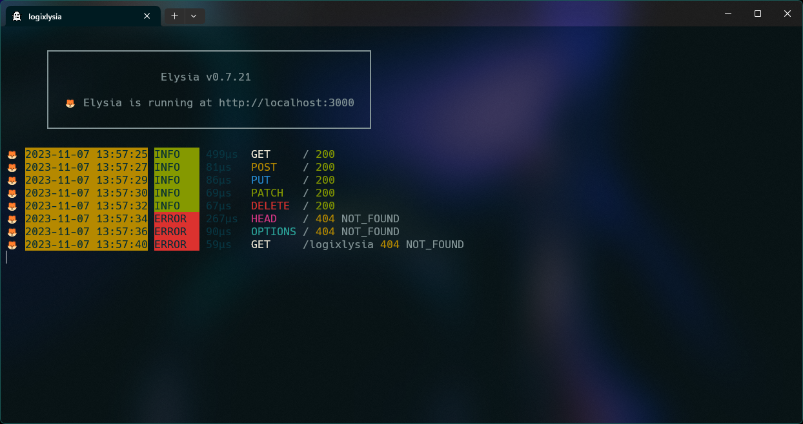

<div align="center">
  <h1><code>🦊</code> Logixlysia</h1>
  <strong>Logixlysia is a logging library for ElysiaJS</strong>
  
</div>

## `📩` Installation

```bash
bun add logixlysia
```

## `📝` Usage

```ts
import { Elysia } from 'elysia'
import { logger } from 'logixlysia'

const app = new Elysia({
  name: 'Logixlysia Example'
}).use(logger())

app.listen(3000)
```

## `📚` Documentation

### Options

| Option | Type      | Description                                                           | Default |
| ------ | --------- | --------------------------------------------------------------------- | ------- |
| `ip`   | `boolean` | Display the incoming IP address based on the `X-Forwarded-For` header | `false` |

## `📄` License

Licensed under the [MIT License](LICENSE).
