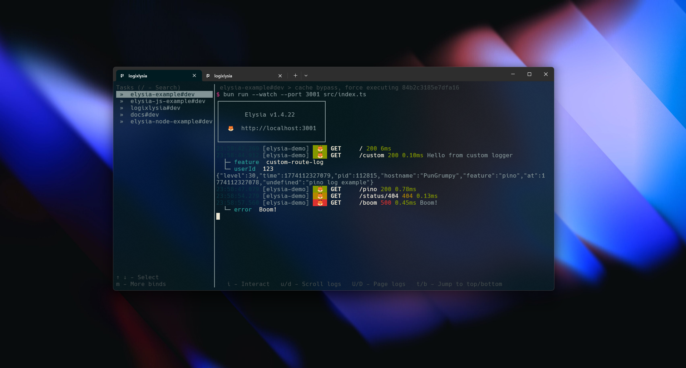

Logixlysia is a powerful logging plugin for [Elysia.js](https://elysiajs.com/) that provides structured, high-performance logging integrated with [Pino](https://github.com/pinojs/pino). Built for production environments, it offers flexible configuration, file logging, and seamless integration with your Elysia applications.



## Features

- **High Performance** - Powered by Pino, one of the fastest Node.js loggers
- **Structured Logging** - JSON-first approach for better log analysis
- **Flexible Configuration** - Customize format, level, and output destinations
- **File Logging** - Save logs to files with automatic rotation
- **Transport Support** - Send logs to external services
- **Type Safe** - Full TypeScript support

## Quick Start

```ts
import { Elysia } from 'elysia'
import logixlysia from 'logixlysia'

const app = new Elysia()
  .use(logixlysia())
  .get('/', () => 'Hello World')
  .listen(3000)
```

## Installation

```bash
bun add logixlysia
```

## Why Logixlysia?

Logixlysia combines the simplicity of Elysia's plugin system with Pino's high-performance logging engine. It provides a clean API for logging requests, responses, and custom events while maintaining minimal overhead.

Whether you're building a small API or a large-scale application, Logixlysia scales with your needs—from simple console logging to complex multi-transport setups.

## Next Steps

- [Get started with basic usage](/usage)
- [Explore features](/features)
- [Learn about configuration options](/usage#configuration)
