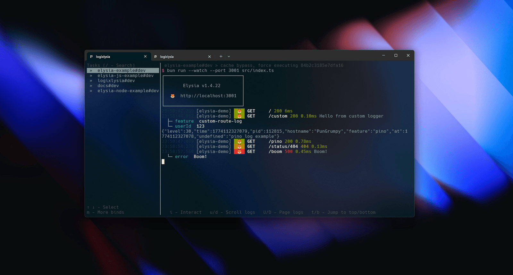

Elogs 是 [Elysia.js](https://elysiajs.com/) 的日志插件，基于 [Pino](https://github.com/pinojs/pino) 构建。面向 Elysia 2 的 open-beta 版本，提供请求作用域的 context API、`X-Request-Id` 头透传、OpenTelemetry trace 关联、AI-SDK 指标、WebSocket 日志，以及一条统一的 emit 管道，分发给 console、文件和任意 transport。



## 为什么选 Elogs

- **统一 emit 管道** — 每条日志走同一条 filter → context-merge → redact → transport → file → console 路径。format、level、目标地址由请求一次性决定，不再每个输出各自决定。
- **请求作用域 context** — `store.logger.mergeContext(request, {...})` 在请求过程中累积字段，并合并到最终的 access log。开启 `useAsyncLocalStorage: true` 时，任意深度的调用栈都能通过 `useLogger()` 拿到同一份 context。
- **WeakMap 时序隔离** — 每个并发请求拥有独立的 `beforeTime` 和 pathname，access log 的耗时永远不会被互相污染。
- **File sink + 句柄缓存** — `logFilePath` 写入走 `queueMicrotask` 批写、缓存文件句柄，默认 `0o600` / `0o700` 权限。
- **Request ID 透传** — `X-Request-Id`（或自定义头）入口读、出口回显，包括错误响应。
- **OpenTelemetry 关联** — 安装 `@opentelemetry/api` 后，`injectTraceContext` 把活动 span 的 `trace_id` 和 `span_id` 合并到 access log。
- **AI-SDK 指标** — `mergeAIMetrics` 一次性挂载 model / provider / token 数 / 延迟到 `context.ai` 字段，沿用 evlog wide event 的形态。
- **自动错误翻译** — `autoTranslate: { db: 'drizzle' }` 在单点 onError 钩子里跑翻译链，把 driver 错误码映射成合适的状态码决定日志级别，不劫持响应格式。
- **Transport 管道** — 任意 `{ log: (level, message, meta) => void | Promise<void> }` 都可以接入，同步异常和异步 reject 在 5s 窗口内节流，热路径永远干净。

## 快速开始

```ts
import { Elysia } from 'elysia'
import { createElogs } from '@pori15/elogs'

const app = new Elysia()
  .use(createElogs())
  .get('/', () => 'Hello World')
  .listen(3000)
```

## 安装

```bash
bun add @pori15/elogs elysia@next
```

本版本面向 [Elysia 2 open beta](https://elysiajs.com/blog/elysia-20)。还在用 Elysia 1.4？请见 [Elysia 2 支持](/docs/elysia-2)。

## 下一步

- [基础用法](/docs/usage)
- [完整配置参考](/docs/configuration)
- [浏览 features](/docs/features/startup)
