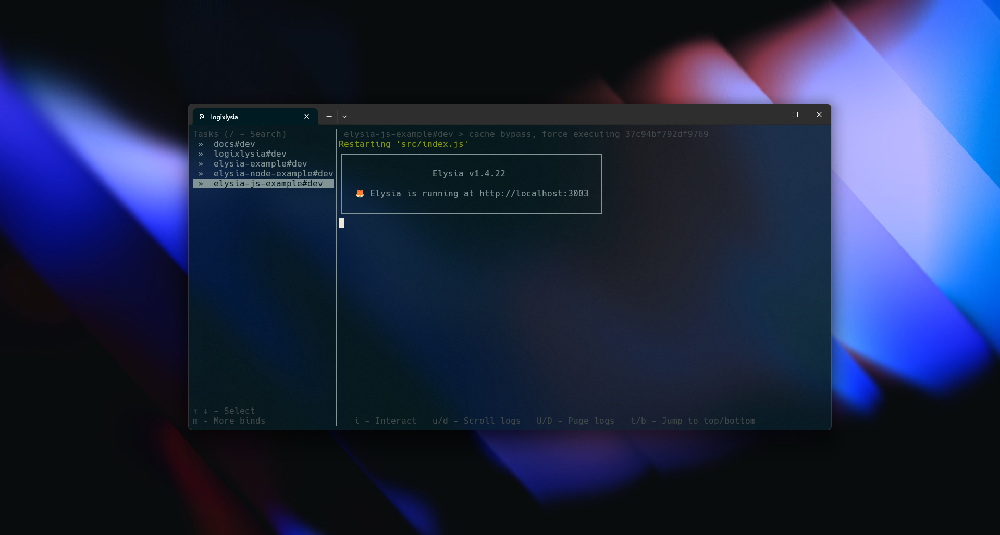

# Elysia JS (Node) Example with Logixlysia

Example application demonstrating Logixlysia logging plugin with Elysia.js on **Node.js (plain JavaScript / ESM)**.



## Overview

This example is similar to `apps/elysia-node`, but uses:

- **JavaScript (ESM)** instead of TypeScript
- **Node.js runtime** with `@elysiajs/node` adapter
- Logixlysia startup banner + request logging

## Getting Started

### Installation

From the monorepo root:

```bash
bun install
```

### Running the Example

```bash
cd apps/elysia-js
bun run dev
```

The server will start on `http://localhost:3003` (or the port specified in `PORT` environment variable).

## Configuration

This example uses the following Logixlysia configuration:

```js
logixlysia({
  config: {
    timestamp: {
      translateTime: 'yyyy-mm-dd HH:MM:ss'
    },
    customLogFormat: '🦊 {now} {level} {duration} {method} {pathname} {status} {message} {ip} {context}',
    logFilePath: './logs/example.log',
    ip: true
  }
})
```

## Example Endpoints

### Available Routes

#### `GET /status/:code`

```bash
curl http://localhost:3003/status/200
curl http://localhost:3003/status/404
curl http://localhost:3003/status/500
```

#### `GET /pino`

```bash
curl http://localhost:3003/pino
```

#### `GET /custom`

```bash
curl http://localhost:3003/custom
```

#### `GET /boom`

```bash
curl http://localhost:3003/boom
```

## Log Output

Logs are written to:

- **Console**: Formatted logs with emoji and colors
- **File**: `./logs/example.log` (created automatically)

## Notes for Node.js + ESM

- Node.js ESM requires explicit file extensions in relative imports (e.g. `./routers/index.js`).
- This example is intended to validate that Logixlysia works correctly in Node.js + JavaScript environments (including the startup banner).

