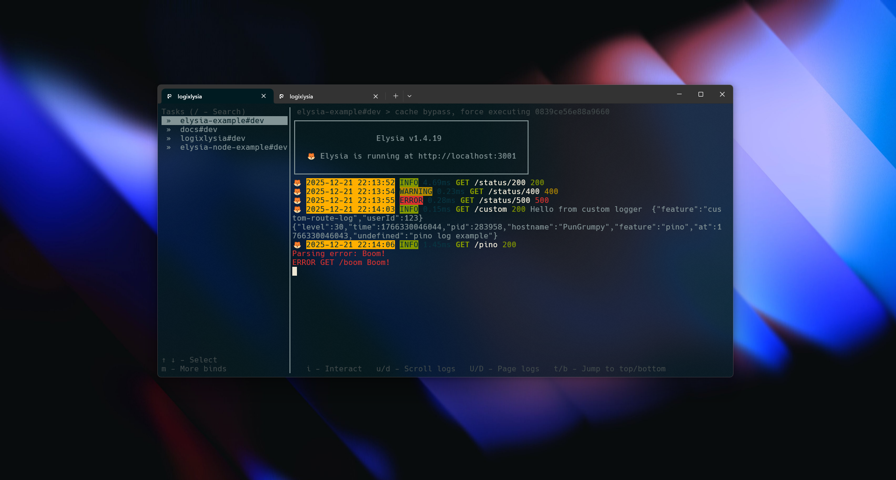

# Elysia Example with Logixlysia

Example application demonstrating Logixlysia logging plugin with Elysia.js.



## Overview

This example shows how to integrate Logixlysia into an Elysia.js application, including:

- Basic request/response logging
- Custom log formatting
- File logging with rotation
- Pino integration
- Error handling and logging
- Custom logger usage

## Getting Started

### Installation

```bash
bun install
```

### Running the Example

```bash
bun run dev
```

The server will start on `http://localhost:3001` (or the port specified in `PORT` environment variable).

## Configuration

This example uses the following Logixlysia configuration:

```ts
logixlysia({
  config: {
    timestamp: {
      translateTime: 'yyyy-mm-dd HH:MM:ss'
    },
    customLogFormat: '🦊 {now} {level} {duration} {method} {pathname} {status} {message} {ip} {context}',
    logFilePath: './logs/example.log',
    ip: true
  }
})
```

## Example Endpoints

### Swagger Documentation

Visit `http://localhost:3001/swagger` to see the interactive API documentation.

### Available Routes

#### `GET /status/:code`

Test different HTTP status codes and see how they're logged.

```bash
curl http://localhost:3001/status/200
curl http://localhost:3001/status/404
curl http://localhost:3001/status/500
```

#### `GET /pino`

Example of using Pino logger directly from the store.

```bash
curl http://localhost:3001/pino
```

#### `GET /custom`

Example of using the custom logger helper with context.

```bash
curl http://localhost:3001/custom
```

#### `GET /boom`

Example of error handling and automatic error logging.

```bash
curl http://localhost:3001/boom
```

## Log Output

Logs are written to:
- **Console**: Formatted logs with emoji and colors
- **File**: `./logs/example.log` (created automatically)

## Features Demonstrated

1. **Automatic Request/Response Logging**: All requests are automatically logged with status codes
2. **Custom Log Format**: Custom format string with placeholders
3. **File Logging**: Logs are saved to files for persistence
4. **Pino Integration**: Direct access to Pino logger for structured logging
5. **Custom Logger**: Using logger helper methods with context
6. **Error Handling**: Automatic error logging with stack traces

## Learn More

- [Logixlysia Documentation](/)
- [Elysia.js Documentation](https://elysiajs.com)
- [Pino Documentation](https://github.com/pinojs/pino)

