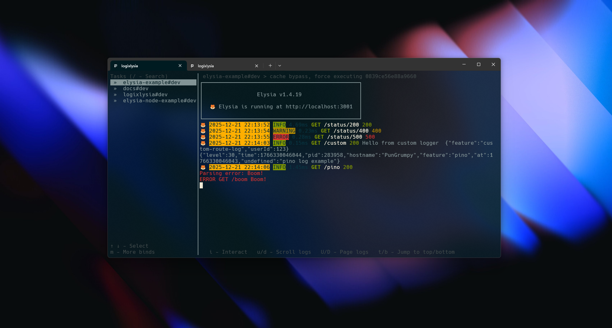

# Elysia playground (Logixlysia demo)

Canonical demo for Logixlysia on **Bun + TypeScript**. Node.js compatibility is covered by integration tests in `packages/logixlysia/__tests__/integration`.



## Overview

- `preset: 'dev'` with service name and slow-request thresholds
- Request context (`mergeContext`) on `/checkout`
- AI metrics (`logixlysia/ai`) on `POST /chat`
- OpenTelemetry hook (`logixlysia/otel`) on `/trace`
- WebSocket lifecycle via `plugin.wrapWs` on `/ws`
- Classic examples: `/status/:code`, `/pino`, `/custom`, `/boom`, `/auto-redact`

## Getting Started

From the monorepo root:

```bash
bun install
cd apps/elysia
bun run dev
```

Server: `http://localhost:3001` (override with `PORT`).

Swagger UI: `http://localhost:3001/swagger`

## Configuration

```ts
logixlysia({
  preset: 'dev',
  config: {
    service: 'elysia-demo',
    logFilePath: './logs/example.log',
    ip: true,
    autoRedact: true
  }
})
```

## Routes

| Method | Path | What it shows |
|--------|------|----------------|
| GET | `/` | Welcome |
| GET | `/checkout` | Request context on access log |
| POST | `/chat` | `mergeAIMetrics` → `context.ai` |
| GET | `/trace` | `injectTraceContext` (needs active OTel span for IDs) |
| WS | `/ws` | `wrapWs` lifecycle + context on socket |
| GET | `/status/:code` | Status-based log levels |
| GET | `/pino` | Direct Pino from store |
| GET | `/custom` | Custom `logger.info` with context |
| GET | `/boom` | Error logging |
| GET | `/auto-redact` | PII redaction in logs |

### Quick curls

```bash
curl http://localhost:3001/
curl http://localhost:3001/checkout
curl -X POST http://localhost:3001/chat
curl http://localhost:3001/trace
curl http://localhost:3001/status/404
curl http://localhost:3001/boom
```

## Logs

- **Console**: Pretty dev output (preset `dev`)
- **File**: `./logs/example.log`

## Testing without this app

```bash
cd packages/logixlysia
bun test
bun test __tests__/integration
```

The integration suite mirrors these demo routes and includes a **Node adapter** smoke test (`@elysiajs/node`).

## Learn more

- [Logixlysia docs](https://logixlysia.vercel.app)
- [Elysia.js](https://elysiajs.com)
